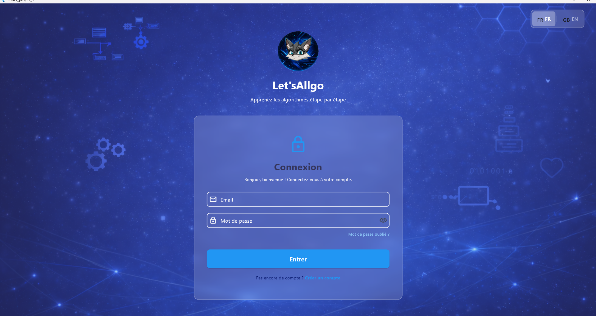
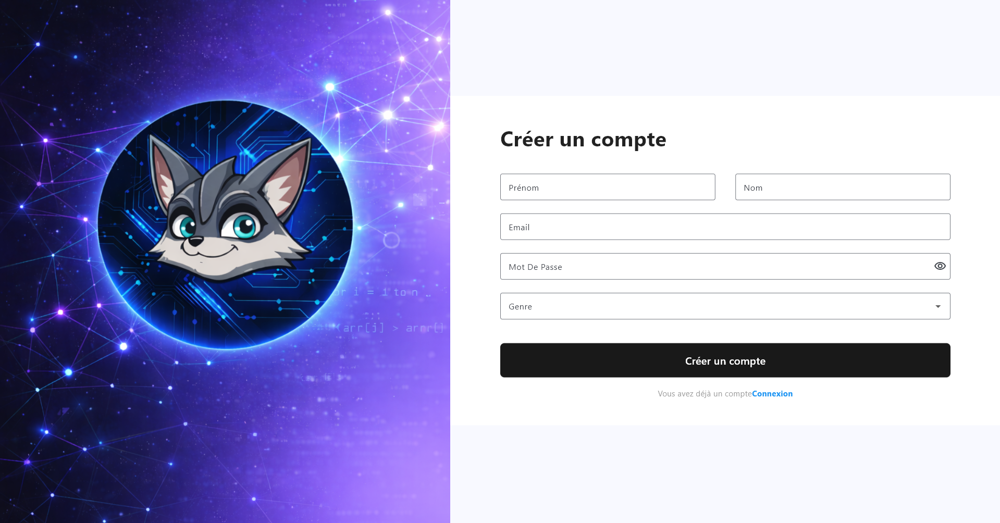
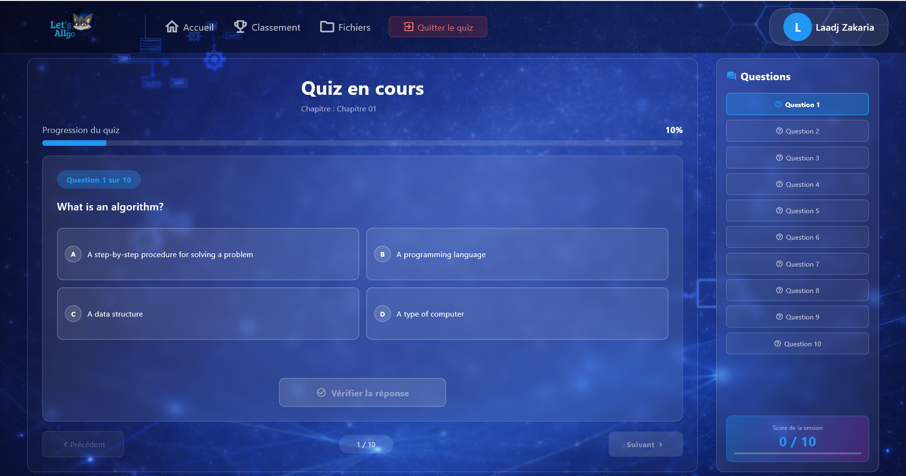
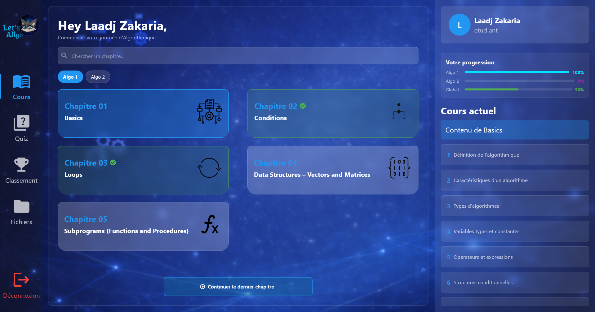
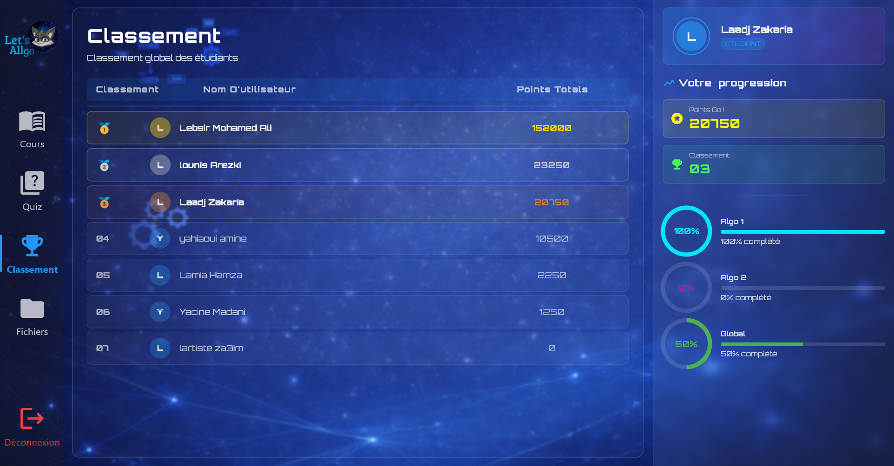
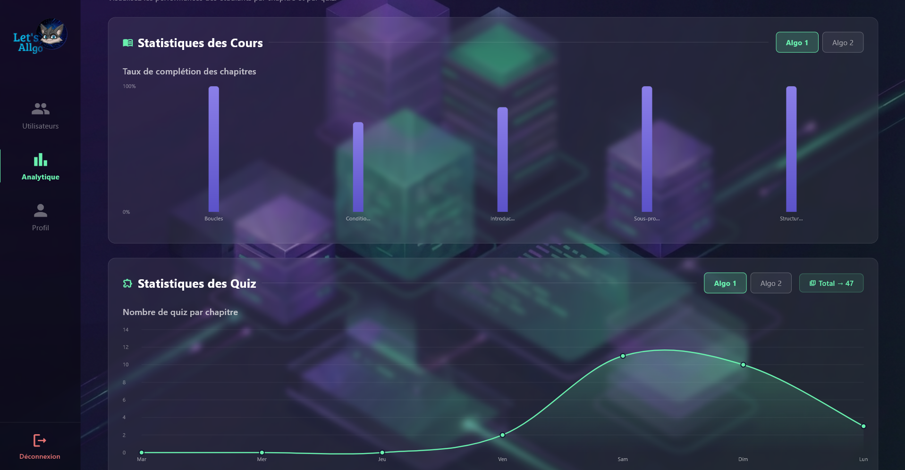
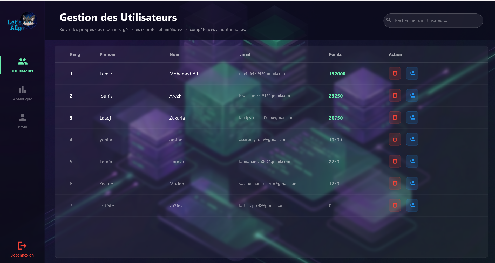

<!-- @format -->

<h1 align="center">LetsAllGo 🦊</h1>

<p align="center">
  <strong>An interactive platform to learn and practice Algorithmics and Data Structures — all in one place to Go!</strong>
  <br />
  <em>Designed for CS students and coding beginners seeking structured, gamified academic learning.</em>
</p>

<p align="center">
  
</p>

<p align="center">
  <a href="#-quick-start"></a>
  <a href="#-license"></a>
  
  
  
  
  
  
</p>

---

## 📖 About the Project

**LetsAllGo** is a university graduation project developed by a team of 7 students with the goal of consolidating scattered academic resources into a single, engaging platform. Students preparing for Algorithmics and Data Structures courses often face the challenge of sourcing quality material — lecture notes, practice problems, past exams, and exercises — from multiple disconnected places.

LetsAllGo solves this by providing a unified, gamified learning environment where students can study theory, test their knowledge, and access vetted academic files from universities across the country — all within a clean mobile interface.

> _"The goal is not just to study algorithms — it's to understand them, practice them, and track how far you've come."_

---

## ✨ Features

### 📚 Course Content

- Complete **Algorithmics 1 & 2** course material with structured lessons
- Coverage of core data structures: linked lists, stacks, queues, trees, graphs, hash tables, and more
- Step-by-step algorithm explanations with worked examples

### 🎲 Randomized Quizzes

- Quizzes generated dynamically from the course content pool
- **Adjustable difficulty intensity** — from beginner warm-ups to exam-level challenges
- Immediate feedback with explanations on wrong answers

### 🗂️ Academic File Repository

- Curated collection of **past exams and TDs** from multiple Algerian universities
- Organized by module, year, and institution
- Searchable and downloadable directly within the app

### 🏆 Gamified Reward System

- Points and badges earned through quiz performance and lesson completion
- Encourages consistent daily engagement through streaks and milestones
- Visual progress indicators tied to course advancement

### 📊 Leaderboard & Personal Dashboard

- **Global leaderboard** ranking students by performance score
- **Personal dashboard** displaying completed modules, quiz history, accuracy rate, and XP
- Progress charts updated in real time after each session

### 🎵 Original Soundtrack

- Custom in-app music composed with **FL Studio** to create a focused, enjoyable study atmosphere

---

## 🖼️ Screenshots

<h2 align="center">Home Screen</h2>

<p align="center">
  
</p>

<h2 align="center">Create Account Screen</h2>

<p align="center">
  
</p>


<h2 align="center">Quiz Interface</h2>

<p align="center">
  
</p>

<h2 align="center">Dashboard</h2>

<p align="center">
  
</p>

<h2 align="center">Leaderboard</h2>

<p align="center">
  
</p>

<h2 align="center">Admin Analytics</h2>

<p align="center">
  
</p>

<h2 align="center">Admin Dashboard</h2>

<p align="center">
  
</p>

<h2 align="center">Admin Secret Code</h2>

<p align="center">
  
</p>

---

## 🗂️ Project Structure

```
Lets_All_Go/
│
└──--
    ├── index.ts
    ├── tsconfig.json
    ├── package.json
    ├── .env
    │
    ├── prisma/
    │   └── schema.prisma
    │
    ├── lib/
    │   │
    │   ├── controllers/
    │   │   ├── auth/
    │   │   │   ├── AuthController.ts
    │   │   │   ├── login_controller.dart
    │   │   │   ├── create_account_controller.dart
    │   │   │   └── verify_account_controller.dart
    │   │   │
    │   │   ├── chapter/
    │   │   │   └── ChapterController.ts
    │   │   │
    │   │   ├── courses_study/
    │   │   │   ├── courses_study_controller.dart
    │   │   │   └── chapter_quiz_controller.dart
    │   │   │
    │   │   ├── dashboard/
    │   │   │   ├── dashboard_controller.dart
    │   │   │   └── algo2_controller.dart
    │   │   │
    │   │   ├── files/
    │   │   │   ├── files_controller.dart
    │   │   │   └── files_algo2_controller.dart
    │   │   │
    │   │   ├── leaderboard/
    │   │   │   └── leaderboard_controller.dart
    │   │   │
    │   │   ├── profil/
    │   │   │   └── profil_controller.dart
    │   │   │
    │   │   └── quiz/
    │   │       ├── base_quiz_controller.dart
    │   │       ├── quiz_controller.dart
    │   │       └── algo2_quiz_controller.dart
    │   │
    │   ├── middlewares/
    │   │   └── auth/
    │   │       └── auth.middleware.ts
    │   │
    │   ├── models/
    │   │   ├── auth/
    │   │   │   ├── auth.model.ts
    │   │   │   ├── login_model.dart
    │   │   │   ├── create_account_model.dart
    │   │   │   └── verify_account_model.dart
    │   │   │
    │   │   ├── courses_study/
    │   │   │   └── courses_study_model.dart
    │   │   │
    │   │   ├── dashboard/
    │   │   │   ├── dashboard_model.dart
    │   │   │   └── algo2_model.dart
    │   │   │
    │   │   ├── files/
    │   │   │   └── files_model.dart
    │   │   │
    │   │   ├── leaderboard/
    │   │   │   └── leaderboard_model.dart
    │   │   │
    │   │   └── quiz/
    │   │       └── quiz_model.dart
    │   │
    │   ├── routes/
    │   │   ├── auth/
    │   │   │   └── authRoutes.ts
    │   │   ├── chapter/
    │   │   │   └── chapterRoutes.ts
    │   │   ├── leaderboard/
    │   │   │   └── leaderboardRoutes.ts
    │   │   ├── quiz/
    │   │   │   └── quizRoutes.ts
    │   │   └── user/
    │   │       └── userRoutes.ts
    │   │
    │   ├── services/
    │   │   ├── auth/
    │   │   │   ├── AuthService.ts
    │   │   │   └── email.service.ts
    │   │   ├── chapter/
    │   │   │   └── chapter.service.ts
    │   │   ├── leaderboard/
    │   │   │   └── leaderboard.service.ts
    │   │   ├── quiz/
    │   │   │   └── quiz.service.ts
    │   │   └── user/
    │   │       └── user.service.ts
    │   │
    │   ├── utils/
    │   │   └── verificationStore.ts
    │   │
    │   ├── service/                   ← Flutter services
    │   │   ├── auth/
    │   │   │   └── LoginService.dart
    │   │   ├── quiz/
    │   │   │   └── quiz_score_service.dart
    │   │   ├── progress/
    │   │   │   └── progress_service.dart
    │   │   ├── auth_service.dart
    │   │   ├── chapter_complete_service.dart
    │   │   ├── language_service.dart
    │   │   ├── LoginService.dart
    │   │   └── serviceXML.dart
    │   │
    │   └── views/
    │       ├── admin/
    │       │   └── admin_welcome_page.dart
    │       │
    │       ├── auth/
    │       │   ├── login_page.dart
    │       │   ├── create_account_page.dart
    │       │   └── welcome/
    │       │       └── welcome_page.dart
    │       │
    │       ├── courses_study_page/
    │       │   ├── courses_study_page.dart
    │       │   └── chapter_quiz_page.dart
    │       │
    │       ├── dashboard/
    │       │   ├── dashboard_page.dart
    │       │   └── algo2_grid.dart
    │       │
    │       ├── files/
    │       │   ├── files_page.dart
    │       │   └── algo2_files_grid.dart
    │       │
    │       ├── leaderboard/
    │       │   └── leaderboard_page.dart
    │       │
    │       ├── pdf_images_views/
    │       │   ├── pdf_viewer_page.dart
    │       │   └── image_viewer_page.dart
    │       │
    │       ├── profil/
    │       │   └── profil_page.dart
    │       │
    │       └── quiz/
    │           ├── quiz_selection_page.dart
    │           └── quiz_page_content.dart
    │
    ├── assets/
    │   ├── images/
    │   │   ├── background.png
    │   │   ├── background1.jpg
    │   │   ├── logo1_login.png
    │   │   ├── image_create_account.png
    │   │   ├── icone_dash.png
    │   │   ├── masscott01.png
    │   │   ├── icons_algo1/
    │   │   │   ├── basics_icone.png
    │   │   │   ├── si_sinon_icon.png
    │   │   │   ├── loops_icone.png
    │   │   │   ├── vectors_matris_icon.png
    │   │   │   └── fonction_procedure_icone.png
    │   │   └── icons_algo2/
    │   │       ├── data_structure_icone.png
    │   │       ├── files_icone.png
    │   │       ├── listes_icones.png
    │   │       └── stacks_icone.png
    │   │
    │   ├── sounds/
    │   │   ├── PRESS_1.wav
    │   │   ├── PRESS_2.wav
    │   │   ├── CORRECTANSWER.mp3
    │   │   ├── WRONGANSWER.mp3
    │   │   └── CHEERS.wav
    │   │
    │   ├── data/
    │   │   ├── algo1/
    │   │   │   ├── cours/
    │   │   │   │   ├── chapitre01.xml
    │   │   │   │   ├── chapitre02.xml
    │   │   │   │   ├── chapitre03.xml
    │   │   │   │   ├── chapitre04.xml
    │   │   │   │   └── chapitre05.xml
    │   │   │   └── quiz/
    │   │   │       ├── chapitre01.xml
    │   │   │       ├── chapitre02.xml
    │   │   │       ├── chapitre03.xml
    │   │   │       ├── chapitre04.xml
    │   │   │       └── chapitre05.xml
    │   │   └── algo2/
    │   │       ├── cours/
    │   │       │   ├── chapitre01.xml
    │   │       │   ├── chapitre02.xml
    │   │       │   ├── chapitre03.xml
    │   │       │   └── chapitre04.xml
    │   │       └── quiz/
    │   │           ├── chapitre01.xml
    │   │           ├── chapitre02.xml
    │   │           ├── chapitre03.xml
    │   │           └── chapitre04.xml
    │   │
    │   └── files/                     ← academic files (PDFs, images)
    │
    ├── pubspec.yaml
    ├── analysis_options.yaml
    └── node_modules/
```

---

## 🛠️ Tech Stack

| Layer            | Technology            | Purpose                                                      |
| ---------------- | --------------------- | ------------------------------------------------------------ |
| Mobile Frontend  | Flutter 3.x           | Cross-platform mobile UI (iOS & Android)                     |
| Backend API      | Node.js + Express     | RESTful API server                                           |
| ORM              | Prisma                | Type-safe database access layer                              |
| Database         | PostgreSQL (Supabase) | Relational data storage and real-time capabilities           |
| Auth & Storage   | Supabase              | Authentication, file storage, row-level security             |
| Email Service    | Brevo                 | Automated transactional emails (registration, notifications) |
| Music Production | FL Studio             | Original in-app ambient soundtrack                           |

---

## 🚀 Quick Start

### Prerequisites

- [Flutter SDK](https://flutter.dev/docs/get-started/install) (v3.x or above)
- [Node.js](https://nodejs.org/) (v18 or above) and npm
- A [Supabase](https://supabase.com/) account with a project created
- A [Brevo](https://www.brevo.com/) account for email credentials

### 1. Clone the repository

```bash
git clone https://github.com/your-org/LetsAllGo.git
cd LetsAllGo
```

### 2. Set up the backend

```bash
cd backend
npm install
cp .env.example .env
# Fill in your Supabase DATABASE_URL and Brevo API key in .env
npx prisma migrate dev
npm run dev
```

### 3. Set up the mobile app

```bash
cd mobile
flutter pub get
# Update lib/utils/constants.dart with your backend API base URL
flutter run
```

---

## 👥 Team

LetsAllGo was conceived and built as a graduation project by seven members:

| Name                   | Role                                             |
| ---------------------- | ------------------------------------------------ |
| **Ilyes Kersani**      | Project Lead & Frontend Developer                |
| **Mohamed Ali Lebsir** | Flutter & Backend Developer (Most contributions) |
| **Zakaria Laadj**      | Flutter Developer & UI/UX Designer               |
| **Yacine Madani**      | Backend Developer & Sound Designer(FL Studio)    |
| **Arezki Lounis**      | Report Structure & Database Setup                |
| **Fouad Mahrez**       | Content & Academic Resources                     |
| **Mouloud Kherbouche** | Database Schema & Corrections                    |

---

## 🤝 Contributing

This project was developed as a university graduation project. External contributions are not open at this time. For academic inquiries or collaboration proposals, please open an issue.

---

## 📄 License

This project is licensed under the **MIT License**. See the [LICENSE](LICENSE) file for details.

---

<p align="center">
  <em>Built with care by seven students who wanted to make studying algorithms a little less painful — and a little more rewarding.</em>
</p>
